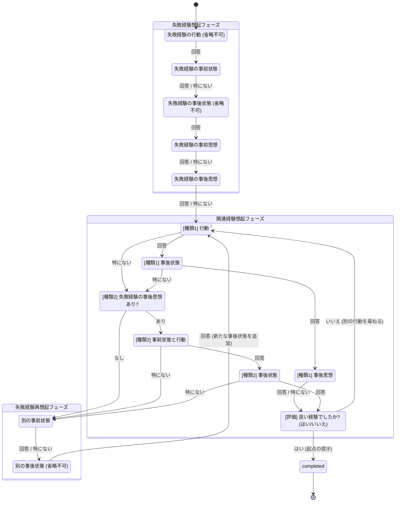

# 対話戦略の状態遷移

対話制御部（`backend/counseling/dialogue/controller.py`）は、次の状態遷移に従って動きます。
状態と遷移の定義本体は `backend/counseling/dialogue/states.py` の `STATES` と `TRANSITIONS` です。

各状態は「1つの要素を尋ねている状態」です。どの状態でも、ユーザの応答は次の3種類です（3.1 共通処理）。

| 応答 | 処理 |
|---|---|
| 回答を入力 | 回答を経験DBに保存し、「回答あり」の遷移先へ進む |
| 思いつかない | 経験想起支援機能で具体例を生成して提示し、**同じ状態のまま**応答を待つ（何度でも可。2回目以降はそれまでの具体例をプロンプトに含め、異なる例を生成する） |
| 特にない | 回答を保存せず、「回答なし」の遷移先へ進む。**省略不可**の状態では受け付けない（ボタンが無効） |

評価の状態だけは「はい／いいえ」で答えます（「思いつかない」「特にない」は使えません）。

## 状態遷移図

## 状態一覧

| 状態キー | フェーズ | 尋ねる要素 | 省略不可 | 回答あり → | 回答なし（特にない） → | 回答の保存先（経験DB） |
|---|---|---|---|---|---|---|
| `failure_action` | 失敗経験想起 | 失敗経験の行動 | ○ | `failure_pre_state` | （不可） | 失敗経験.行動 |
| `failure_pre_state` | 失敗経験想起 | 失敗経験の事前状態 | | `failure_post_state` | `failure_post_state` | 失敗経験.事前状態に追加 |
| `failure_post_state` | 失敗経験想起 | 失敗経験の事後状態 | ○ | `failure_pre_thought` | （不可） | 失敗経験.事後状態に追加 |
| `failure_pre_thought` | 失敗経験想起 | 失敗経験の事前思想 | | `failure_post_thought` | `failure_post_thought` | 失敗経験.事前思想 |
| `failure_post_thought` | 失敗経験想起 | 失敗経験の事後思想 | | `related1_action` | `related1_action` | 失敗経験.事後思想 |
| `related1_action` | 関連経験想起 | [種類1] 失敗経験の事後状態でとった行動 | | `related1_post_state` | `type2_entry` | 関連経験(種類1)を新規作成：行動、事前状態＝失敗経験の最新の事後状態 |
| `related1_post_state` | 関連経験想起 | [種類1] その経験の事後状態 | | `related1_post_thought` | `type2_entry` | 関連経験.事後状態に追加 |
| `related1_post_thought` | 関連経験想起 | [種類1] その経験の事後思想 | | `evaluation` | `evaluation` | 関連経験.事後思想 |
| `type2_entry` | （擬似状態） | 失敗経験の事後思想が得られているか判定 | | あり → `related2_pre_state_action` | なし → `rerecall_pre_state` | ― |
| `related2_pre_state_action` | 関連経験想起 | [種類2] 事後思想に基づいて行動した経験の事前状態と行動 | | `related2_post_state` | `rerecall_pre_state` | 関連経験(種類2)を新規作成：事前状態と行動、事前思想＝失敗経験の事後思想 |
| `related2_post_state` | 関連経験想起 | [種類2] その経験の事後状態 | | `evaluation` | `rerecall_pre_state` | 関連経験.事後状態に追加 |
| `evaluation` | 関連経験想起 | [評価] その経験を肯定的に評価しているか | ○ | はい → `completed` / いいえ → `related1_action` | （不可） | 関連経験.評価 |
| `rerecall_pre_state` | 失敗経験再想起 | 失敗経験の行動によって生じた別の事前状態 | | `rerecall_post_state` | `rerecall_post_state` | 失敗経験.事前状態に追加 |
| `rerecall_post_state` | 失敗経験再想起 | 失敗経験の行動によって生じた別の事後状態 | ○ | `related1_action` | （不可） | 失敗経験.事後状態に追加（以降の種類1の質問はこの事後状態を使う） |
| `completed` | 終了 | ― | | ― | ― | ― |

- `completed` に入るとき、起点を提示して対話を終了します（種類1なら `origin_type1`、種類2なら `origin_type2` のテンプレート）。
- `related1_action` と `related2_pre_state_action` に入るたびに、新しい関連経験の想起を始めます。途中で打ち切られた関連経験も経験DBに残ります（評価は「未評価」）。
- 各状態の質問文は `backend/prompts/questions.json` の同名のキー、具体例生成のプロンプトは `backend/prompts/recall_support/<状態キー>.txt` です。
